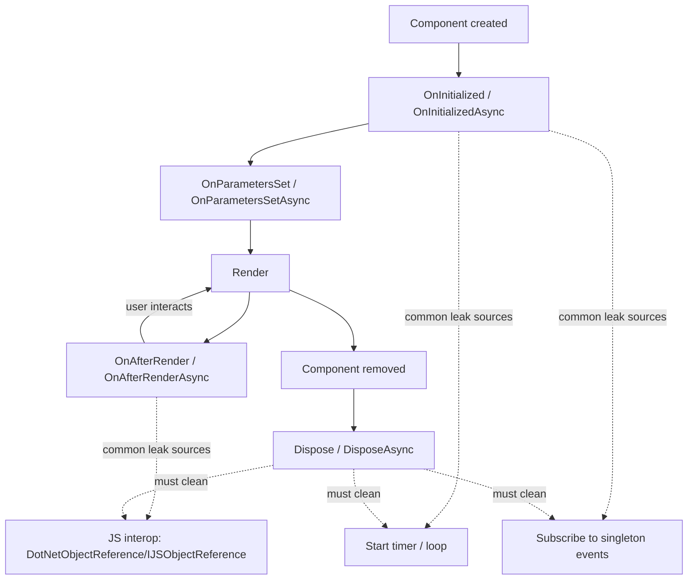

# Memory Leak Scenarios in ASP.NET Core 8+ Blazor Server and .NET Application Layers

## Executive summary

Blazor Server’s memory profile is fundamentally *stateful*: each browser tab creates a *circuit* with a long-lived server-side object graph, and disconnected circuits are retained for a period to support reconnection (default retention is **3 minutes**). This architecture makes “memory not going down” a common *false positive*, because circuit-rooted objects naturally drift to **Gen 2** and may not be reclaimed until a Gen 2 collection occurs. citeturn16view0turn34view0

In production, the most common and severe *true* leaks still follow classic .NET patterns: long-lived roots (static fields, singletons, caches, event publishers) accidentally hold references to per-request / per-circuit objects; unbounded queues or caches grow without eviction; disposables (streams, timers, interop handles) aren’t disposed; and EF Core tracking grows unbounded when DbContext lifetimes are too long or tracking is left enabled for large read-heavy queries. citeturn34view0turn32view0turn39view0turn39view1turn31view0

A Blazor-specific high-risk category is *DI lifetime mismatch across circuits*: in interactive server-side Blazor, the DI scope lasts for the **duration of the circuit**, so scoped services (and even *transient disposables*) can live much longer than a component. Microsoft specifically warns that disposable transient services injected into components can be held by the container for the circuit lifetime—preventing garbage collection when the component is disposed. citeturn33view0

A rigorous leak program for ASP.NET Core 8+ should therefore do three things:  
1) distinguish *managed heap live size* from *process working set* and understand GC behavior (Server GC vs Workstation GC), LOH, and retention; citeturn34view0turn0search3turn8search1  
2) implement proactive guardrails (bounded caches/queues, correct DI scoping, disposal discipline, streaming for large responses); citeturn31view0turn35view0turn32view0turn5search1turn39view0  
3) continuously test for “heap growth that never plateaus” with repeatable harnesses and diagnostics tooling (dotnet-counters, dotnet-trace, dotnet-gcdump, dotnet-dump, Visual Studio/PerfView). citeturn4search0turn4search9turn4search2turn14search1turn14search14

## Leakage taxonomy and retention mechanics

A **.NET “memory leak”** is typically *not* a failure of GC to run—it’s that the GC **cannot free objects that are still referenced** (reachable from GC roots). In ASP.NET Core, common roots include: static fields, singleton services, caches, background threads/timers, diagnostic subscribers, or long-lived per-connection state. citeturn34view0turn32view0

Blazor Server adds two structural retention forces:

* **Circuit object graphs**: each user session/tab creates a circuit; circuits maintain state for interactivity and may be retained while disconnected for reconnection. Circuit-rooted objects tend to end up in **Gen 2**, so you may not see reclamation until a Gen 2 GC. citeturn16view0turn34view0  
* **Disconnected circuit pool**: when a client disconnects, the server retains a limited number of circuits for a retention period (default: 3 minutes). Tuning retention period and max retained circuits directly affects memory footprint and can eliminate “looks like a leak” reports that are actually retention-by-design. citeturn16view0turn13search0turn13search9

Separately, **process memory** and **GC heap** are not the same. .NET may keep memory reserved/committed for performance even after objects are collected; working set may not drop immediately even if the heap’s live object size drops. citeturn16view0turn34view0

Finally, large allocations create special pressure:
* **LOH (Large Object Heap)**: large arrays/strings allocate on LOH; LOH behavior can lead to fragmentation and Gen 2 pressure; “memory not released” after huge allocations is often LOH + GC heuristics rather than a true leak. citeturn0search3turn34view0turn28view0  
* **Pinning / GCHandle**: pinned objects inhibit compaction and can cause fragmentation; failing to free GCHandles can cause leaks. citeturn6search3turn6search18turn8search5

Mermaid diagram — simplified component lifetime and disposal touchpoints (where leaks often originate):  

Blazor lifecycle guidance explicitly calls out that event handlers should be unhooked on disposal. citeturn38view0turn37view0

Mermaid diagram — DI lifetime “shape” in Blazor Server vs classic request pipeline:  
```mermaid
flowchart LR
  Root[Root ServiceProvider] -->|Singletons| S[Singleton services]
  Root -->|Request scope| Req[HTTP Request Scope]
  Root -->|Circuit scope| Cir[Blazor Circuit Scope]

  Req --> Sc1[Scoped services (per-request)]
  Req --> Tr1[Transient services (per-request disposal)]

  Cir --> Sc2[Scoped services (per-circuit)]
  Cir --> Tr2[Transient disposables can be retained by container\nfor circuit lifetime]

  note1["Avoid singleton -> scoped capture (captive dependency).\nUse IServiceScopeFactory when needed."] --- S
```
The .NET DI docs warn against resolving scoped services from singletons without an explicit scope, and Blazor DI docs emphasize the circuit-long scope and transient disposable pitfalls. citeturn32view0turn33view0

## Prioritized scenario catalog

### Prioritization model

This report ranks scenarios by **frequency** (how often seen in real systems) and **severity** (probability of OOM / availability impact). Blazor Server–specific retention behaviors are also marked, because they are frequent sources of misdiagnosis. citeturn16view0turn34view0

### High-frequency/high-severity scenarios

The following scenario families consistently dominate production incidents:

* **Unbounded caches/collections** (IMemoryCache misuse, static dictionaries, unbounded queues). citeturn31view0turn34view0turn35view0  
* **DI lifetime mismatches** (singleton capturing scoped; Blazor circuit-scoped services retaining per-component state; transient disposables in components). citeturn32view0turn33view0  
* **Event subscription leaks** (publisher outlives subscriber; common with singleton state containers and diagnostic listeners). citeturn37view0turn34view0turn11search0  
* **EF Core tracking growth** when DbContext is long-lived or tracking is left on for large read queries. citeturn39view0turn39view1turn39view2  
* **Long-lived background services** that accumulate state or enqueue faster than they drain. citeturn3search3turn35view0turn9search1  
* **JS interop reference leaks** (DotNetObjectReference / JS object references not disposed). citeturn36view0turn37view0

### Catalog table

The table below summarizes each scenario, its root cause, where the reproducible snippet appears (Sxx), recommended detection tools, and the primary mitigation pattern.

| Scenario ID | Layer | Root cause (summary) | Snippet ref | Best detection tools | Primary mitigation |
|---|---|---|---|---|---|
| S01 | Blazor component + JS interop | DotNetObjectReference not disposed, GC can’t reclaim | S01 | dotnet-gcdump, dotnet-dump gcroot, VS snapshots | Dispose DotNetObjectReference / IJSObjectReference |
| S02 | Blazor + JS | JS event listeners/timers not removed; DOM/JS keeps refs | S02 | Browser heap snapshots + server heap | JS cleanup in DisposeAsync; handle JSDisconnectedException |
| S03 | Blazor component | Component subscribes to long-lived events; not unsubscribed | S03 | dotnet-dump gcroot, PerfView heap diff | Unsubscribe in Dispose/DisposeAsync |
| S04 | Blazor + timers/async | Timer/loop captures component; not cancelled/disposed | S04 | dotnet-trace allocations, heap snapshots | Cancel CTS, dispose timer, guard StateHasChanged |
| S05 | Blazor rendering | RenderFragment/lambda closure captures large graph and is retained | S05 | Heap diff, allocation stacks | Avoid capturing huge closures; don’t store delegates long-term |
| S06 | Blazor state/cascading/@ref | Large per-circuit state retained by circuit DI scope | S06 | Gen2/LOH trends; per-circuit profiling | Shrink per-circuit state; persist externally; scope per component |
| S07 | Blazor circuit retention | Disconnected circuits retained by design → false “leak” | S07 | dotnet-counters + circuit counts | Tune retention/max retained; reduce per-circuit memory |
| S08 | SignalR hub | Per-connection state stored in static/dictionary; not removed | S08 | Heap diff; hub connection count vs dict size | Cleanup in OnDisconnectedAsync; timeouts |
| S09 | SignalR streaming/CTS | Token registrations or stream tasks accumulate; misuse or bugs | S09 | heap growth in registrations/tasks | Dispose registrations/CTS; keep packages patched |
| S10 | Middleware | Conventional middleware constructed once; instance fields retain data | S10 | gcroot shows middleware instance | Don’t store per-request state in fields; use IMiddleware |
| S11 | Controllers/API | Huge responses create LOH pressure; “memory not released” | S11 | LOH size, Gen2 rate, dumpheap -stat | Stream results; avoid huge strings; reduce buffering |
| S12 | DI lifetimes | Captive dependencies; transient disposables retained in Blazor | S12 | gcroot → singleton/service provider | Fix lifetimes; use factories/OwningComponentBase |
| S13 | Caching | IMemoryCache unbounded growth; external keys | S13 | memory plateaus never happen | Set SizeLimit/expirations; validate keys |
| S14 | Session state | Large session payloads in in-memory store; long timeouts | S14 | memory vs sessions; cache size | Keep session small; distributed cache; short idle timeout |
| S15 | Hosted services | Background loop accumulates; scopes/CTS not disposed | S15 | heap growth correlated with uptime | Use proper cancellation/scoping; bounded queue |
| S16 | Channels/queues | Unbounded Channel/BlockingCollection → runaway memory | S16 | heap growth; queue length via metrics | Bounded channel, backpressure/drop policy |
| S17 | EF Core | Long-lived DbContext + tracking; large tracked graphs | S17 | dumpheap DbContext/EntityEntry counts | Short-lived DbContext; AsNoTracking; Clear tracker |
| S18 | Streaming/IAsyncEnumerable | Slow clients keep enumerators/DbContext open | S18 | open connections + DbContext scoped retention | Cancel/timeout; detach context lifetime from stream |
| S19 | IO + HttpClient | Not disposing streams; HttpClient misuse causing resource leaks | S19 | handle counts; socket stats; heap | Dispose/await using; IHttpClientFactory or proper static client |
| S20 | Interop/GC config | GCHandle/pinning/unmanaged allocations not freed; wrong GC limits | S20 | GC handles metric; dumpheap/poh/loh; native memory | Free GCHandle; SafeHandle; tune GC heap limits |

### Scenario details with reproducible sketches

**S01 — Blazor Server: DotNetObjectReference not disposed (JS→.NET callback leak)**  
**Description & root cause:** JS interop stores a .NET object reference in an internal map keyed by an ID; if you don’t dispose the `DotNetObjectReference`, the object can remain reachable and prevent GC, and Microsoft explicitly calls out disposal to avoid leaks. citeturn36view0turn37view0  
**Minimal repro (S01):**
```csharp
// S01: DotNetObjectReference leak
@page "/leak/dotnetobjectref"
@inject IJSRuntime JS

<button @onclick="Init">Init</button>

@code {
  private DotNetObjectReference<LeakPage>? _ref;

  private async Task Init()
  {
    _ref = DotNetObjectReference.Create(this);
    await JS.InvokeVoidAsync("window.storeDotNetRef", _ref); // JS caches it
  }

  // BUG: no Dispose/DisposeAsync implemented => _ref never disposed
}
```
**Reproduce:** Navigate to `/leak/dotnetobjectref`, click Init, navigate away; repeat 100–1000 times (or open/close tabs).  
**Expected memory behavior:** Without the bug, `LeakPage` instances should become unreachable after navigation + circuit cleanup; with the bug, retained instances persist and heap grows (often in Gen2). citeturn16view0turn37view0  
**Detect:** `dotnet-gcdump` and Visual Studio snapshots show increasing `DotNetObjectReference<LeakPage>` / `LeakPage`; `dotnet-dump analyze` + `gcroot` shows JSInterop map retaining it. citeturn4search2turn14search1turn14search14  
**Mitigation:** Implement `IDisposable`/`IAsyncDisposable` and dispose `DotNetObjectReference` (and any JS modules / object references). citeturn36view0turn37view0turn6search1  
**Demo app harness:** A page that creates N refs and exposes a “Dispose correctly” toggle; the test asserts object count plateaus when disposal is enabled.

**S02 — Blazor + JS: event listeners/timers not removed (client leak + server retention chain)**  
**Description & root cause:** JS listeners/timers can keep DOM nodes, closures, and sometimes .NET instance handles alive; Blazor guidance highlights the need to dispose interop references and perform DOM cleanup during disposal. citeturn37view0turn36view0  
**Minimal repro (S02):**
```csharp
// S02: JS listener leak chain
@implements IAsyncDisposable
@inject IJSRuntime JS

@code {
  private IJSObjectReference? _module;

  protected override async Task OnAfterRenderAsync(bool firstRender)
  {
    if (!firstRender) return;
    _module = await JS.InvokeAsync<IJSObjectReference>("import", "./leaky.js");
    await _module.InvokeVoidAsync("addLeakyListener");
  }

  // BUG: DisposeAsync does NOT call removeLeakyListener and does not dispose module
  public ValueTask DisposeAsync() => ValueTask.CompletedTask;
}
```
**Reproduce:** Navigate to page; trigger `addLeakyListener`; navigate away and back repeatedly; watch browser memory in DevTools *and* server heap if .NET refs are involved.  
**Expected memory behavior:** Correct cleanup removes listeners and disposes JS object references; memory should plateau after GC cycles. citeturn37view0turn34view0  
**Detect:** Browser heap snapshots show retained listener closures; server heap shows retained interop objects; `dotnet-trace` highlights repeated allocations in interop paths. citeturn4search9turn14search14turn37view0  
**Mitigation:** In `DisposeAsync`, invoke JS cleanup (removeEventListener/clearInterval), dispose module; catch `JSDisconnectedException` during circuit loss as recommended. citeturn36view0turn37view0  
**Demo harness:** Paired “leaky.js” vs “fixed.js” modules; record both server heap and browser heap graphs.

**S03 — Blazor Server component: event subscription to long-lived publisher (classic managed leak)**  
**Description & root cause:** If an object that exposes events outlives the subscriber component, the delegate holds the subscriber alive. Blazor disposal guidance explicitly warns this causes leaks and recommends unsubscribing when the publisher outlives the component. citeturn37view0turn34view0  
**Minimal repro (S03):**
```csharp
// S03: Singleton event holds component alive
public class AppState
{
  public event Action? Changed;
  public void Notify() => Changed?.Invoke();
}

@page "/leak/events"
@implements IDisposable
@inject AppState State

@code {
  protected override void OnInitialized()
    => State.Changed += OnChanged;

  private void OnChanged() { /* references 'this' */ }

  // BUG: forget to unsubscribe
  public void Dispose() { /* missing: State.Changed -= OnChanged; */ }
}
```
**Reproduce:** Navigate to the page then away; repeat; keep `AppState` alive as singleton.  
**Expected memory behavior:** Without unsubscribe, old component instances remain rooted via `AppState.Changed` invocation list. citeturn37view0turn34view0  
**Detect:** `dotnet-dump analyze` → `dumpheap -type <component>` grows; `gcroot` shows `AppState` event backing field path. citeturn14search1turn14search2turn34view0  
**Mitigation:** Unsubscribe in `Dispose`, or use weak event patterns / `IDisposable` subscription tokens. citeturn37view0turn6search0  
**Demo harness:** A “publisher singleton” page with a “leak mode” toggle; test asserts component count stays ~constant when fixed.

**S04 — Blazor component: timer/async loop captures component; cancellation not handled**  
**Description & root cause:** Timers and background loops frequently capture `this` (component), keep it referenced, and/or continue calling `InvokeAsync(StateHasChanged)` after navigation. The Blazor disposal docs demonstrate disposing timers and note correct synchronization. citeturn37view0turn38view0  
**Minimal repro (S04):**
```csharp
// S04: Periodic task leak
@implements IDisposable

@code {
  private CancellationTokenSource _cts = new();
  protected override void OnInitialized()
  {
    _ = Task.Run(async () =>
    {
      while (true) // BUG: never exits
      {
        await Task.Delay(500);
        await InvokeAsync(StateHasChanged);
      }
    });
  }
  public void Dispose() { /* BUG: _cts.Cancel not used; loop continues */ }
}
```
**Reproduce:** Navigate in/out; the loop continues; instances remain reachable.  
**Expected memory behavior:** Correct cancellation allows task to complete; disposed components become collectible. citeturn34view0turn37view0  
**Detect:** `dotnet-trace` shows continuing task activity; heap shows growing state machines / component instances. citeturn4search9turn14search14  
**Mitigation:** Use `while (!cts.IsCancellationRequested)`, dispose CTS; avoid fire-and-forget without cancellation; prefer `PeriodicTimer` or hosted services for global tasks. citeturn3search3turn6search1  
**Demo harness:** A “navigation churn” Playwright test that clicks pages 1000 times; leak shows monotonic heap growth.

**S05 — RenderFragment/lambda closure retains large object graph**  
**Description & root cause:** C# closures capture referenced variables. If a `RenderFragment` or delegate is stored in a long-lived service (singleton cache, circuit-scoped state), it can retain large graphs (e.g., DTO lists, images) even after UI changes. (This is a general C# retention pattern; it becomes acute in stateful Blazor circuits.) citeturn16view0turn34view0  
**Minimal repro (S05):**
```csharp
// S05: Closure leak via cached RenderFragment
public class FragmentCache { public RenderFragment? Cached; } // registered singleton

@inject FragmentCache Cache

@code {
  protected override void OnInitialized()
  {
    var big = new byte[50_000_000]; // ~50MB
    Cache.Cached = builder => builder.AddContent(0, big.Length); // captures big
  }
}
```
**Reproduce:** Hit page once; memory jumps; navigate away; memory stays high because singleton holds fragment.  
**Expected behavior:** Without caching captured closures, big buffer is collectible once page is gone. citeturn34view0  
**Detect:** Heap snapshots show `byte[]` retained by `FragmentCache.Cached` closure. citeturn14search14turn14search1  
**Mitigation:** Avoid caching fragments that capture large state; cache *data IDs* not *captured graphs*; if caching is required, store immutable small models and reconstruct fragment per render. citeturn31view0turn34view0  
**Demo harness:** “RenderFragment closure leak” page with adjustable payload size; dump analysis shows which closure retains buffer.

**S06 — Cascading values/@ref/component references create large per-circuit footprints**  
**Description & root cause:** In Blazor Server, scoped services and component state live for the circuit lifetime; injecting or storing large state in circuit-scoped services can inflate per-circuit memory. Blazor DI guidance warns the circuit scope can cause services to live longer than a component, and recommends patterns (OwningComponentBase) to limit lifetime. citeturn33view0turn16view0  
**Minimal repro (S06):**
```csharp
// S06: Per-circuit "state container" holding large state (scoped)
builder.Services.AddScoped<UserState>();

public class UserState { public byte[] Big = new byte[20_000_000]; }

@inject UserState State // lives for circuit lifetime
```
**Reproduce:** Open 100 tabs/users; memory scales linearly with circuits; close tabs and observe retention until circuit eviction + Gen2 GC. citeturn16view0turn33view0  
**Expected behavior:** Memory per active circuit is expected; reclaimed when circuit is evicted and a Gen2 GC occurs. citeturn16view0  
**Detect:** `dotnet-counters` shows Gen2 heap growth, LOH growth; correlate with active circuit count. citeturn4search0turn16view0turn4search8  
**Mitigation:** Keep circuit state minimal; persist big state externally; if you need scoped services tied to component lifetime, use `OwningComponentBase` patterns. citeturn33view0turn16view0  
**Demo harness:** “Per-circuit payload” slider + scripted multi-tab opener; record per-circuit memory curve.

**S07 — Disconnected circuit retention: common false-positive “leak”**  
**Description & root cause:** Blazor Server retains disconnected circuits for a retention period and a max retained count; default retention is 3 minutes, and only after eviction is the circuit eligible for collection. This is frequently misinterpreted as a leak. citeturn16view0turn13search0turn13search9  
**Minimal repro (S07):**
```csharp
// S07: Repro "leak" by rapid refresh creating many circuits
// Run load: refresh page rapidly; observe memory rising for ~3 minutes.

builder.Services.AddRazorComponents().AddInteractiveServerComponents();
builder.Services.Configure<CircuitOptions>(o =>
{
  // default behavior retains disconnected circuits for reconnection
  // o.DisconnectedCircuitRetentionPeriod = TimeSpan.FromMinutes(3);
  // o.DisconnectedCircuitMaxRetained = 100;
});
```
**Reproduce:** Refresh in a loop (or a bot). Memory rises, then should drop after retention window + Gen2 GC. citeturn16view0turn13search0turn13search9  
**Expected behavior:** Plateau after warm-up; drop only after eviction + Gen2 collection; working set may remain high even if heap live size drops. citeturn16view0turn34view0  
**Detect:** Use `dotnet-counters` to confirm GC activity and heap sizes; don’t rely solely on Task Manager/working set. citeturn4search0turn16view0turn34view0  
**Mitigation:** Reduce disconnected retention/max retained when appropriate; reduce per-circuit memory; validate whether it’s a scale issue vs true leak (Blazor doc lays out criteria). citeturn16view0turn13search0turn13search9  
**Demo harness:** “Circuit churn” endpoint plus a chart of memory vs time, annotated with retention window.

**S08 — SignalR Hub: per-connection state stored in static/dictionary not removed**  
**Description & root cause:** SignalR hubs expose `OnConnectedAsync`/`OnDisconnectedAsync` to track connections; if you store per-connection state in a static dictionary but fail to remove it in `OnDisconnectedAsync`, memory grows with every connection. citeturn15search0turn34view0  
**Minimal repro (S08):**
```csharp
// S08: Hub connection state leak
public class ChatHub : Hub
{
  private static readonly ConcurrentDictionary<string, byte[]> _state = new();

  public override Task OnConnectedAsync()
  {
    _state[Context.ConnectionId] = new byte[5_000_000];
    return base.OnConnectedAsync();
  }

  // BUG: missing removal on disconnect
  public override Task OnDisconnectedAsync(Exception? ex)
    => base.OnDisconnectedAsync(ex);
}
```
**Reproduce:** Connect/disconnect repeatedly (or at scale); `_state` only grows.  
**Expected behavior:** `_state` should track active connections only; size should fluctuate but remain bounded. citeturn15search0turn34view0  
**Detect:** Heap dump shows `ConcurrentDictionary` retaining arrays; correlate with SignalR connection counts. citeturn14search1turn15search0  
**Mitigation:** Remove on disconnect; add TTL/cleanup for “dirty” disconnects; avoid static state unless bounded. citeturn15search0turn34view0  
**Demo harness:** A load generator that opens N websocket connections and churns them while tracking dict size.

**S09 — SignalR streaming + cancellation registrations: accumulation via misuse or known bugs**  
**Description & root cause:** Two sub-patterns commonly appear:  
1) app-level misuse—creating `CancellationTokenSource`/registrations for streaming without disposing them; registrations can retain callback state; citeturn6search1turn34view0  
2) framework/library-level bugs—e.g., a reported SignalR client streaming memory leak involving cancellation token callbacks, later closed with a milestone (7.0.13), illustrating why keeping packages patched matters. citeturn12view0  
**Minimal repro (S09):**
```csharp
// S09: CancellationTokenRegistration not disposed
static List<CancellationTokenRegistration> _regs = new();

public static void LeakRegistrations(CancellationToken token)
{
  var reg = token.Register(() => { /* captures large state */ });
  _regs.Add(reg); // BUG: never Dispose; list grows
}
```
**Reproduce:** Start streaming repeatedly; register callbacks each time; never dispose → steady growth.  
**Expected behavior:** Registrations are disposed after use; list does not grow; with fixed framework versions, known leaks should not reproduce. citeturn6search1turn12view0  
**Detect:** `dumpheap -stat` shows `CancellationTokenSource`/`CancellationCallbackInfo` growth; `gcroot` ties them to registration list or SignalR internal state. citeturn14search1turn14search2turn12view0  
**Mitigation:** Dispose registrations/CTS; ensure streaming enumerables respect cancellation; keep SignalR packages updated. citeturn6search1turn12view0turn15search3  
**Demo harness:** A “stream upload loop” endpoint that runs for minutes; compare patched vs unpatched package versions.

**S10 — Middleware: conventional middleware constructed once; instance fields become hidden singletons**  
**Description & root cause:** Microsoft states middleware is **constructed once per application lifetime**. If you store per-request data in instance fields, you retain it across requests and can leak request objects or large payloads. citeturn25search0turn34view0  
**Minimal repro (S10):**
```csharp
// S10: Middleware instance field retention
public class LeakyMiddleware
{
  private readonly RequestDelegate _next;
  private readonly List<byte[]> _payloads = new(); // grows forever

  public LeakyMiddleware(RequestDelegate next) => _next = next;

  public async Task InvokeAsync(HttpContext ctx)
  {
    _payloads.Add(new byte[1_000_000]); // BUG: retained for app lifetime
    await _next(ctx);
  }
}
```
**Reproduce:** Hit any endpoint in a loop; memory grows monotonically.  
**Expected behavior:** Request-specific payloads should be eligible for GC after request. citeturn25search0turn34view0  
**Detect:** `gcroot` shows arrays rooted by `LeakyMiddleware._payloads`. citeturn14search1turn25search0  
**Mitigation:** Don’t keep per-request state in middleware fields; use locals; for DI-friendly per-request activation, use `IMiddleware` (activated per request). citeturn24view0turn25search0  
**Demo harness:** Endpoint `/api/ping` under load with a “retain payload” toggle.

**S11 — Controllers/API: huge responses, serialization pressure, LOH behavior misdiagnosed as a “leak”**  
**Description & root cause:** Large strings/arrays commonly land on LOH and increase Gen2 pressure. A reported “controller memory leak” repro creates a 50M-character string and observes memory not dropping quickly—this pattern often represents LOH + GC + working set behavior rather than a classic rooted-object leak. citeturn28view0turn0search3turn34view0  
**Minimal repro (S11):**
```csharp
// S11: LOH pressure via huge string response
[ApiController]
[Route("api/loh")]
public class LohController : ControllerBase
{
  [HttpGet("{n}")]
  public ActionResult<string> Get(int n)
    => new string('x', n); // try n = 50_000_000
}
```
**Reproduce:** Call `/api/loh/50000000` repeatedly; watch LOH size / Gen2 collections and working set. citeturn28view0turn34view0turn0search7  
**Expected behavior:** Managed object may die quickly, but process memory might not return to OS immediately; Gen2/LOH metrics give a truer picture than working set alone. citeturn16view0turn34view0  
**Detect:** Monitor `System.Runtime` metrics (GC heap, LOH); use heap snapshots to confirm objects aren’t rooted (true leak) vs just reserved memory. citeturn4search8turn14search14turn14search1  
**Mitigation:** Stream large results (`IAsyncEnumerable<T>` or response streaming) to reduce buffering; avoid constructing huge strings; compress at edge where possible. citeturn9search2turn5search3turn34view0  
**Demo harness:** Two endpoints: buffered (`ToList`, huge string) vs streamed (`IAsyncEnumerable`), with side-by-side heap charts.

**S12 — DI lifetimes: captive dependencies + Blazor circuit scope + transient disposables**  
**Description & root cause:** The DI docs warn: resolving scoped services from a singleton causes the scoped service to behave like a singleton, leading to incorrect state and retention. citeturn32view0  
In Blazor Server, scoped services live for the circuit; Microsoft warns this can keep services alive longer than a component. It also warns that injected transient services implementing `IDisposable` can be maintained by the container for the circuit lifetime, causing leaks when components are disposed. citeturn33view0turn16view0  
**Minimal repro (S12):**
```csharp
// S12: Singleton captures scoped
builder.Services.AddScoped<UserState>();
builder.Services.AddSingleton<LeakySingleton>();

public class LeakySingleton
{
  private readonly UserState _state; // BUG: scoped injected into singleton
  public LeakySingleton(UserState state) => _state = state;
}
```
**Reproduce:** Under Blazor Server, per-circuit state becomes effectively global; memory/state bleeds and grows.  
**Expected behavior:** Scoped state should be per request or per circuit as intended, but not accidentally promoted to singleton. citeturn32view0turn33view0  
**Detect:** Scope validation may throw in development; otherwise `gcroot` shows singleton holding scoped graphs. citeturn32view0turn14search1  
**Mitigation:** Fix registrations; for singleton needing scoped work, use `IServiceScopeFactory.CreateScope()` and dispose it; in Blazor, use `OwningComponentBase` to tie service scope to component lifetime. citeturn32view0turn33view0  
**Demo harness:** A page that injects transient disposable vs OwningComponentBase-resolved service; assert disposal occurs when navigating away.

**S13 — IMemoryCache: unbounded growth (no size limits, bad keys, no expirations)**  
**Description & root cause:** Microsoft explicitly states: “Limit cache growth” and that the runtime **does not limit cache size based on memory pressure**; developers must use expirations and SizeLimit/SetSize. citeturn31view0turn34view0  
**Minimal repro (S13):**
```csharp
// S13: Unbounded IMemoryCache
[ApiController, Route("api/cache")]
public class CacheController : ControllerBase
{
  private readonly IMemoryCache _cache;
  public CacheController(IMemoryCache cache) => _cache = cache;

  [HttpGet("{key}")]
  public IActionResult Put(string key)
  {
    // BUG: external input as key; no expiration; large payload
    _cache.Set(key, new byte[2_000_000]);
    return Ok();
  }
}
```
**Reproduce:** Call `/api/cache/{randomGuid}` repeatedly; memory grows without bound.  
**Expected behavior:** With proper eviction/limits, cache size stabilizes. citeturn31view0  
**Detect:** Heap shows many `byte[]` rooted by MemoryCache internals; `dotnet-counters` shows steady heap growth without stabilization. citeturn31view0turn4search0turn14search1  
**Mitigation:** Don’t use arbitrary external input as keys; add expirations; configure `SizeLimit` and set per-entry sizes (or use a dedicated cache instance as cautioned). citeturn31view0  
**Demo harness:** Endpoint that toggles “bounded vs unbounded cache” and logs entry count/size.

**S14 — Session state: large payloads + in-memory session store grow with users**  
**Description & root cause:** Session state is backed by a cache, considered ephemeral, and the in-memory provider stores session data in server memory; default idle timeout is 20 minutes. Disclosure: session isn’t supported in SignalR apps because hubs may execute independent of HTTP context. citeturn29view0  
**Minimal repro (S14):**
```csharp
// S14: Writing big session blobs (server memory growth)
[HttpGet("/api/session/bloat")]
public IActionResult Bloat()
{
  var bytes = new byte[5_000_000];
  HttpContext.Session.Set("blob", bytes);
  return Ok(bytes.Length);
}
```
**Reproduce:** Many users hit endpoint; sessions stay alive for idle timeout; memory grows. citeturn29view0  
**Expected behavior:** Session should store small identifiers, not large blobs; large data belongs in DB/distributed cache. citeturn29view0  
**Detect:** Heap shows large byte arrays rooted by session cache; correlate with session count. citeturn29view0turn14search1  
**Mitigation:** Keep session small; use distributed cache (Redis/SQL) for scale-out; shorten idle timeout; avoid session for SignalR/Blazor per the doc guidance. citeturn29view0  
**Demo harness:** Endpoint that sets 5MB session value; load test with varying idle timeouts and distributed cache options.

**S15 — Hosted services/worker services: unbounded state accumulation + missing disposal/scoping**  
**Description & root cause:** Hosted services are the standard pattern for background tasks and queued work; mistakes include: never-ending loops without cancellation, unbounded internal lists, and creating DI scopes without disposing them. citeturn3search3turn32view0turn34view0  
**Minimal repro (S15):**
```csharp
// S15: Hosted service unbounded list leak
public class LeakyWorker : BackgroundService
{
  private readonly List<byte[]> _items = new();

  protected override async Task ExecuteAsync(CancellationToken stoppingToken)
  {
    while (true) // BUG: ignore stoppingToken
    {
      _items.Add(new byte[1_000_000]);
      await Task.Delay(1000);
    }
  }
}
```
**Reproduce:** Run app for hours/days; memory grows with uptime.  
**Expected behavior:** With bounded queues and proper cancellation, memory should plateau. citeturn3search3turn34view0  
**Detect:** `dotnet-counters` shows monotonic heap; dump shows `_items` retaining arrays. citeturn4search0turn14search1  
**Mitigation:** Always honor `stoppingToken`; use bounded channels/queues; if resolving scoped services, create a scope via `IServiceScopeFactory` and dispose it. citeturn32view0turn35view0turn3search3  
**Demo harness:** Background-service scenario that reports queue length and heap; CI test runs for 5 minutes and checks plateau.

**S16 — Channels/BlockingCollection: unbounded producer wins → runaway memory**  
**Description & root cause:** `System.Threading.Channels` supports unbounded and bounded channels; unbounded channels accept writes indefinitely. The docs emphasize bounded channels, full-mode behavior, and backpressure when writers outrun readers. BlockingCollection similarly supports bounding to control memory usage. citeturn35view0turn9search1turn9search9  
**Minimal repro (S16):**
```csharp
// S16: Unbounded channel grows forever
var ch = Channel.CreateUnbounded<byte[]>();

_ = Task.Run(async () => {
  while (true) await ch.Writer.WriteAsync(new byte[500_000]);
});

_ = Task.Run(async () => {
  await foreach (var item in ch.Reader.ReadAllAsync())
    await Task.Delay(100); // slow consumer
});
```
**Reproduce:** Run; memory grows steadily.  
**Expected behavior:** With bounded channel + Wait/Drop policies, memory stays under a predictable cap. citeturn35view0turn9search8  
**Detect:** Heap shows many queued arrays; `dotnet-trace` shows allocation hot path as producer loop. citeturn4search9turn35view0  
**Mitigation:** Use `Channel.CreateBounded` with capacity and `BoundedChannelFullMode` suited to your domain; implement backpressure or dropping. citeturn35view0turn9search8  
**Demo harness:** Choose capacity and drop policy at runtime; verify memory cap under high producer load.

**S17 — EF Core: long-lived DbContext + tracking causes retained entity graphs**  
**Description & root cause:** EF Core describes DbContext as a short-lived “unit of work” and stresses disposing it to unregister hooks and prevent leaks; entities are tracked until DbContext is disposed or tracking is cleared/detached. Tracking queries are default; read-only queries should use no-tracking to avoid tracker growth. citeturn39view0turn39view1turn39view2  
**Minimal repro (S17):**
```csharp
// S17: DbContext kept too long + tracking large results
public class Repo
{
  private readonly AppDbContext _db; // scoped (or worse: singleton)
  public Repo(AppDbContext db) => _db = db;

  public async Task LoadLots()
    => await _db.Blogs.ToListAsync(); // tracked by default
}
```
**Reproduce:** Call `LoadLots` repeatedly; tracked entities accumulate if DbContext lives long enough.  
**Expected behavior:** Short-lived contexts discard tracking state after each unit-of-work; read-only queries avoid tracking. citeturn39view0turn39view1turn39view2  
**Detect:** Dump shows many `EntityEntry`/tracked entities; `gcroot` ties them to a long-lived DbContext. citeturn14search1turn39view2  
**Mitigation:** Ensure DbContext lifetime aligns with unit-of-work; prefer `AsNoTracking()` for read-only; if you must reuse context, `ChangeTracker.Clear()` detaches efficiently. citeturn39view1turn39view2turn39view0  
**Demo harness:** Toggle `AsNoTracking` and DbContext lifetime; compare memory plateaus.

**S18 — Streaming/IAsyncEnumerable: slow clients keep enumerators/resources alive**  
**Description & root cause:** ASP.NET Core supports `IAsyncEnumerable<T>` to stream results; this reduces buffering but means an open response can keep enumerators and resources alive until completion/cancellation. Best-practices docs highlight `IAsyncEnumerable` as an async streaming option. citeturn9search2turn34view0  
**Minimal repro (S18):**
```csharp
// S18: Streaming ties up resources for slow clients
[HttpGet("/api/stream")]
public async IAsyncEnumerable<int> Stream([EnumeratorCancellation] CancellationToken ct)
{
  for (int i = 0; i < int.MaxValue; i++)
  {
    ct.ThrowIfCancellationRequested();
    yield return i;
    await Task.Delay(1000, ct);
  }
}
```
**Reproduce:** Start many clients that read slowly or never finish; server retains enumerators and any captured resources.  
**Expected behavior:** With timeouts/cancellation, streaming connections end and resources are released; without, memory/handles can accumulate. citeturn34view0turn9search2  
**Detect:** Monitor open connections; heap snapshots show many active enumerator state machines. citeturn14search14turn4search0  
**Mitigation:** Enforce cancellation/timeouts; avoid streaming with captured DbContext; isolate per-request resources so they are disposed on cancel. citeturn39view0turn6search1  
**Demo harness:** A “slow reader simulator” that opens N streams and reads 1 item/min; check whether server memory plateaus.

**S19 — IO + HttpClient: not disposing streams; HttpClient misuse & resource leakage**  
**Description & root cause:** ASP.NET Core memory guidance notes that incorrect HttpClient usage can cause *resource leaks* (sockets/handles) and stresses disposing IDisposable resources. Official HttpClient guidance recommends either reusing static/singleton HttpClient with `PooledConnectionLifetime` or using `IHttpClientFactory`; factory-created clients are intended to be short-lived and safe to dispose while handlers are pooled. citeturn34view0turn5search1turn5search0turn5search11turn5search4turn6search20  
**Minimal repro (S19):**
```csharp
// S19: Per-request HttpClient (bad) + stream not disposed
[HttpGet("/api/http-leak")]
public async Task<string> Leak()
{
  var client = new HttpClient(); // BUG: frequent create/dispose pattern
  var stream = await client.GetStreamAsync("https://example.com"); // BUG: stream not disposed
  return "ok";
}
```
**Reproduce:** Load test endpoint; watch socket/handle pressure and memory.  
**Expected behavior:** With IHttpClientFactory or a configured shared HttpClient, sockets are managed; streams disposed promptly. citeturn5search1turn5search11turn6search20  
**Detect:** Handle count metrics, `dotnet-counters` exceptions rate, dumps for `SocketsHttpHandler` references. citeturn4search0turn34view0  
**Mitigation:** Use typed clients via `IHttpClientFactory`; or use a static/singleton `HttpClient` with `SocketsHttpHandler.PooledConnectionLifetime`; always dispose streams (`await using`). citeturn5search1turn5search4turn6search1turn6search20  
**Demo harness:** Endpoint variants: `new HttpClient`, factory client, static client with pooled lifetime; measure sockets + memory.

**S20 — Interop/unsafe/PInvoke + LOH/pinning + GC configuration**  
**Description & root cause:**  
* `GCHandle` must be freed; otherwise leaks may occur and pinned objects remain pinned longer than necessary. citeturn6search18turn6search2  
* Pinning increases fragmentation risk; POH exists to help, but pinning still has costs. citeturn6search3turn8search5  
* Unmanaged resources should be wrapped in `SafeHandle` and disposed; implement Dispose/DisposeAsync patterns as recommended. citeturn6search0turn6search8turn6search1  
* GC configuration options (heap limits, server vs workstation GC) can materially change memory behavior in containers and high-density hosting. citeturn8search1turn34view0turn16view0  
**Minimal repro (S20):**
```csharp
// S20: GCHandle leak (pinning)
static List<GCHandle> Handles = new();

public static void LeakPinned()
{
  var buf = new byte[10_000_000];
  var h = GCHandle.Alloc(buf, GCHandleType.Pinned); // BUG: never Free()
  Handles.Add(h);
}
```
**Reproduce:** Call `LeakPinned` repeatedly; observe GC handles rising and heap fragmentation/pressure.  
**Expected behavior:** With `h.Free()` (or `using`-style wrapper), pinned handle count should not climb; memory stabilizes after GC. citeturn6search18turn6search2turn34view0  
**Detect:** Monitor runtime metrics for GC/heap, plus GC handles (PerfView / dumps); `dotnet-dump` + SOS can inspect handle-related roots. citeturn14search1turn14search2turn4search8  
**Mitigation:** Always free GCHandles; prefer SafeHandle for unmanaged handles; avoid long-lived pinning; tune GC heap limits in containers via supported runtimeconfig/environment settings when needed. citeturn6search0turn6search8turn8search1turn6search18  
**Demo harness:** A “pinning lab” route that leaks pinned arrays in one mode and frees them in another; chart GC handle count.

## Detection and forensics playbook

image_group{"layout":"carousel","aspect_ratio":"16:9","query":["PerfView heap snapshot .NET","dotnet-counters System.Runtime example output","dotnet-dump analyze SOS dumpheap gcroot example","Visual Studio Diagnostic Tools Memory Usage snapshot"],"num_per_query":1}

### A repeatable diagnostic workflow

A production-grade approach is:

**Baseline and clarify “what memory”**  
Use both GC-focused metrics and OS process metrics. Microsoft’s ASP.NET Core memory guidance explains GC generations and why Server GC may favor throughput over memory release; it also notes that working set includes native allocations and other consumers. citeturn34view0turn16view0

**Live monitoring (low overhead)**  
Use `dotnet-counters` to watch `System.Runtime` metrics (GC heap size, Gen2 collections, LOH size) and app counters. citeturn4search0turn4search8

**Allocation timeline + GC events (trace)**  
Use `dotnet-trace` to capture EventPipe traces for allocation hot paths and GC. EventPipe is the cross-platform tracing mechanism used by dotnet-counters/gcdump/trace. citeturn4search9turn4search1

**Heap graph snapshots (fast-ish)**  
Use `dotnet-gcdump` to collect a GC heap graph with minimal overhead for “what’s live” and “what’s holding it.” citeturn4search2turn4search10

**Full memory dump (deepest root-cause)**  
Use `dotnet-dump collect` and analyze with SOS (`dumpheap -stat`, `gcroot`) to find the retaining root chain. citeturn14search1turn14search2turn14search4

### Practical commands/scripts

**Find PID**
```bash
dotnet-counters ps
```
citeturn4search0

**Monitor runtime metrics**
```bash
dotnet-counters monitor -p <PID> System.Runtime
```
citeturn4search0turn4search8

**Collect a trace**
```bash
dotnet-trace collect -p <PID> -o leak.nettrace
# Open leak.nettrace in Visual Studio or PerfView
```
citeturn4search9turn4search1turn14search3

**Collect a GC dump**
```bash
dotnet-gcdump collect -p <PID> -o leak.gcdump
# Open in Visual Studio/PerfView
```
citeturn4search2turn4search10

**Collect and analyze a full dump**
```bash
dotnet-dump collect -p <PID> -o leak.dmp
dotnet-dump analyze leak.dmp
# In SOS prompt:
#   dumpheap -stat
#   dumpheap -type <TypeName>
#   gcroot <ObjectAddress>
```
citeturn14search1turn14search2turn14search4

**Visual Studio snapshots**
Use the Memory Usage diagnostic tool to take snapshots of managed/native heaps and compare them over time. citeturn14search14

### What to look for in evidence

A leak signature in managed memory often looks like:
* managed heap size (especially Gen2/LOH) rises steadily and does not plateau under steady workload; citeturn34view0  
* heap snapshots show specific types monotonically increasing;  
* `gcroot` traces point to: static fields, singleton services, event invocation lists, caches, or unbounded queues. citeturn34view0turn31view0turn25search0turn37view0

A *false positive* signature (especially in Blazor Server) often looks like:
* working set remains high while live managed object size drops; citeturn16view0turn34view0  
* memory spikes correlate with circuit churn and drop only after retention window + Gen2 GC; citeturn16view0turn13search0  
* LOH size increases after large allocations, and memory is not returned quickly to OS even when objects die. citeturn0search3turn34view0turn28view0

## Mitigation patterns and design guardrails

### Blazor Server-specific guardrails

**Treat per-circuit memory as a first-class capacity dimension**  
Blazor’s deployed memory guidance frames memory roughly as:  
(Active Circuits × Per-circuit Memory) + (Disconnected Circuits × Per-circuit Memory). citeturn16view0  
Reduce per-circuit state, and tune disconnected retention/max retained where reconnection UX allows. citeturn13search0turn13search9turn16view0

**Dispose interop references and clean up DOM resources**  
Dispose `DotNetObjectReference` and JS object references; Blazor docs explain this is required to permit GC and avoid leaks. citeturn36view0turn37view0

**Unhook event handlers**  
If the publisher outlives the component, unsubscribe in `Dispose/DisposeAsync`. citeturn37view0turn38view0

**Avoid transient disposables injected into components**  
Microsoft warns that transient disposable services injected into components can be held by the DI container for the circuit lifetime, preventing GC after component disposal. Prefer patterns that scope services to the component (e.g., `OwningComponentBase`) or redesign services. citeturn33view0

### .NET/ASP.NET Core-wide guardrails

**Fix DI lifetime mismatches (“captive dependency”)**  
Do not inject scoped services into singletons unless you explicitly create/dispose a scope; the .NET DI docs warn this promotes scoped to singleton-like behavior. citeturn32view0

**Bound your caches**  
Microsoft explicitly states the runtime won’t limit IMemoryCache size based on memory pressure; you must implement expirations and size limits, and avoid external input as keys. citeturn31view0

**Bound your queues**  
Use bounded channels with explicit full-mode behavior to get predictable memory and backpressure; similarly, bound BlockingCollection capacity when applicable. citeturn35view0turn9search1turn9search8

**Use EF Core as short unit-of-work**  
DbContext is designed for short lifetimes; dispose it; use no-tracking for read-heavy queries; clear tracker when needed. citeturn39view0turn39view1turn39view2

**Use HttpClient correctly**  
Follow official guidance: reuse a shared HttpClient with `PooledConnectionLifetime` *or* use `IHttpClientFactory` (handlers pooled, clients short-lived). citeturn5search1turn5search0turn5search4turn5search11

**Prefer SafeHandle + Dispose patterns for interop**  
Implement Dispose/DisposeAsync per guidance; wrap unmanaged handles in SafeHandle rather than writing finalizers yourself. citeturn6search0turn6search8turn6search1

**Tune GC only when you can justify it with measurements**  
ASP.NET Core defaults to Server GC; GC behavior can be configured via project/runtimeconfig/environment settings; GC heap limits are available for resource-constrained environments. citeturn34view0turn8search1turn16view0

## Memory Leak Service demo app and automated validation

### Demo app architecture

Build a single solution containing:
* **Blazor Server app** with pages `/leaks/s01` … `/leaks/s20` where each page hosts one scenario (leaky vs fixed modes).
* **Minimal API / Controllers** that expose endpoints for S11/S13/S14/S18/S19 (buffering vs streaming, cache misuse, session bloat, etc.).
* **SignalR hub** for S08/S09 with a paired client harness to churn connections and streams.

Include an internal **/diagnostics** endpoint in the style of Microsoft’s guidance on measuring memory and GC behavior, showing:
* managed heap size, LOH size, Gen0/1/2 collection counts (from runtime metrics),
* working set, GC heap “live size,” and request rate. citeturn34view0turn4search8

### Automated tests and CI checks

**Leak regression tests (short, deterministic)**
* For each Sxx page/endpoint, run a fixed number of iterations (e.g., 200 navigations, 10k requests) followed by a cool-down period; assert the *slope* of GC heap size approaches ~0.  
* For Blazor pages, drive navigation and interaction using browser automation; focus on scenarios that depend on component disposal cycles.

**CI artifact collection**
* If a threshold is exceeded, automatically collect:
  * `dotnet-counters` time series output,
  * a `dotnet-gcdump` snapshot,
  * optionally a `dotnet-dump` full dump for retention root analysis. citeturn4search0turn4search2turn14search1

**Static/defensive checks**
* Enforce code review rules: no external input as cache keys; no singleton state containers holding per-user graphs; all timed loops require cancellation; no transient disposables injected into Blazor components. citeturn31view0turn33view0turn32view0

### Load test patterns that reliably surface leaks

**Blazor circuit churn**
* Open/close tabs rapidly (or simulate reconnect/disconnect) to reproduce retention window behavior and distinguish it from true leaks. citeturn16view0

**Queue pressure**
* Run producer > consumer tests for channels and logging/telemetry pipelines; bounded vs unbounded should show stark differences. citeturn35view0turn31view0

**Large payload stress**
* Alternate “huge response” calls with idle periods; look for LOH growth and Gen2 churn patterns; verify whether objects remain rooted (true leak) vs retained memory. citeturn0search3turn34view0turn28view0

### Suggested visuals to include in the demo app dashboard

* **Heap growth chart**: `GC Heap Size (MB)` and `LOH Size (MB)` vs time, annotated with Gen2 GC events. citeturn4search8turn34view0  
* **Working set vs managed heap**: show why “Task Manager memory” alone is misleading. citeturn34view0turn16view0  
* **Allocation timeline** (from `dotnet-trace`): top allocation stacks during a leak run. citeturn4search9turn4search1  
* **Retention graph**: for each leaked type, a “top gcroot paths” view (from `dotnet-dump`/SOS or PerfView diff). citeturn14search1turn14search2turn14search3  

This structure yields a reusable “Memory Leak Service” that demonstrates both **true leaks** and **expected retention** (especially in Blazor Server), with a CI loop that catches regressions before they reach production. citeturn16view0turn34view0turn10search8