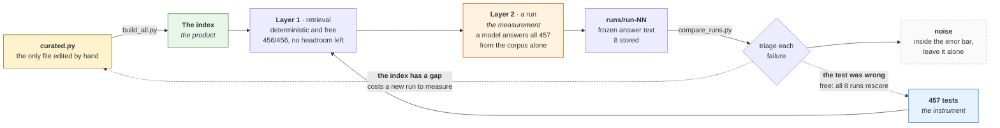
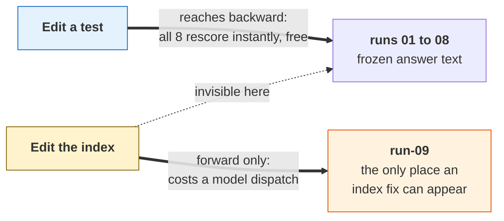

# Measurement

How the stored runs, the unit tests and the index relate to each other.

[`ARCHITECTURE.md`](ARCHITECTURE.md) describes the four pieces and what each one
is. This document covers one thing only: the feedback loop between them, and the
asymmetry in it that decides what a given repair costs.

## The three roles

**The index is the product.** Generated by `build_all.py` from `curated.py` over
the byte-exact split. It is the only hand-tunable thing in the system: its job is
to get an agent from a natural-language question to the right command file.

**The tests are the instrument.** 457 questions, each with required facts and
expected files. Layer 0 validates the test against the document: quotes verbatim,
fact set discriminating. Layer 1 is a deterministic lexical simulation of
retrieval, asking whether the index routes this question to the right file. Layer
1 sits at 456/456, so it has no headroom left; it is a floor, not a grade.

**The runs are the measurements.** A layer 2 run is a real model answering all
457 questions from the corpus alone, with no access to `tools/`. The answers are
written to `runs/run-NN/` and frozen. Scoring asks whether each answer carries
every required fact.



## The asymmetry, which is the part that matters

Edit a **test** and `compare_runs.py` rescores all eight stored runs against it
at zero cost. That is the falsification mechanism: a genuine repair should not
swing runs that had nothing to do with it, and several proposed edits have been
rejected on exactly that evidence.

Edit the **index** and the stored runs cannot see it. A frozen answer cannot
benefit from an index built after it was written, so an index fix is measurable
only by dispatching a new run.



Two consequences follow, and both have already cost this project a wrong
conclusion:

- **A failure rate can mix two different corpora.** `multi-ipsec-policy-nesting`
  showed 3 of 5 failures long after the fix that addressed it, because three of
  those failures were produced against an index that had no Containment section.
  `prepare_run.py --collect` now writes a `corpus.json` digest per run and
  `compare_runs.py` marks such a rate stale. Digests exist from run 06 onward;
  runs 01 to 05 cannot be backfilled.
- **Rescoring repairs the tests side only.** It can never show that an index
  change worked. That is why every index change has to wait for the next run, and
  why the next run is also the falsification of the previous round's test edits.

## The loop

Run, read the failure rates, then triage each failure into one of three verdicts:
the test was wrong, the index has a gap, or it is noise. Fix accordingly. The
next run then falsifies whatever the previous round decided.

## What it has actually bought

Almost every failure has resolved to a test defect rather than a documentation
hole. One confirmed index gap has come out of layer 2 in eight runs: missing
parent-to-child containment, which was fixed by emitting a Containment section in
`entities.md`, and then confirmed by run 05's shard agent naming that section
unprompted as the thing that answered the hierarchy questions.

The larger yield came from layer 1 and `precision.py`: roughly 70 real vocabulary
gaps in `curated.py`, including ones nobody would have guessed, such as `fibre`
reaching nothing because every search term used the American spelling.

Read the suite as a gap-finder for the index, not as proof the documentation
works. Layers 0 and 1 green says nothing about answer quality.

## Current figures

Regenerate rather than quote these. `compare_runs.py` always rescores every
stored run against the working tree, so only its current output is quotable.

```bash
python tools/LLM-Unit-Tests/run_tests.py
python tools/LLM-Unit-Tests/compare_runs.py
python tools/build_all.py --check
```

As of commit `eed09fb`: 457 tests valid, 456 routed with 1 compound question
excluded, 34 build assertions passing. Eight stored runs spread 97.8% to 99.8%;
runs 01 and 02 answered 441 of the current 457, so their denominator differs. 23
tests have failed at least once, none above a 50% rate.
