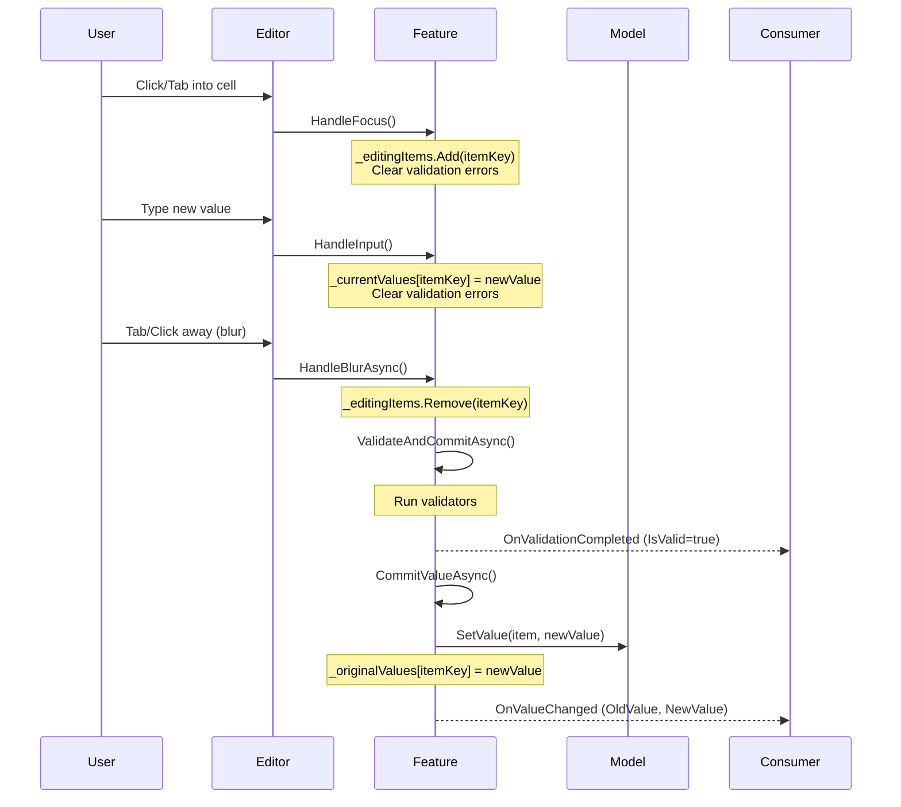
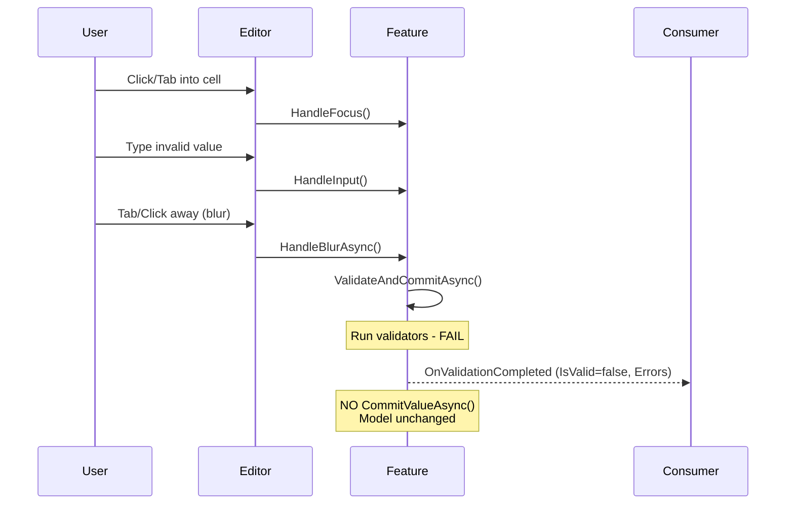
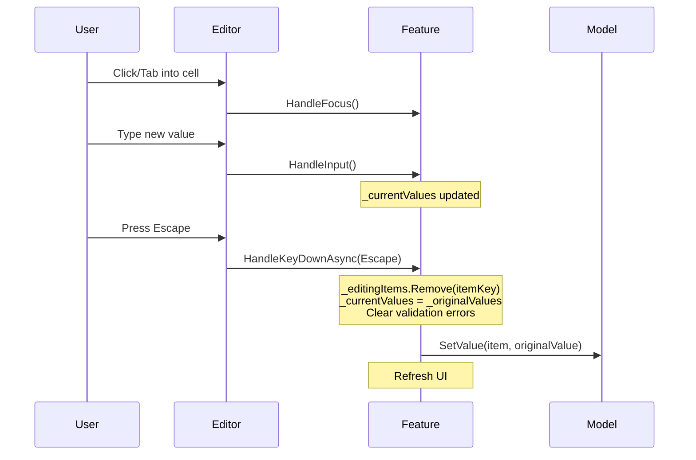
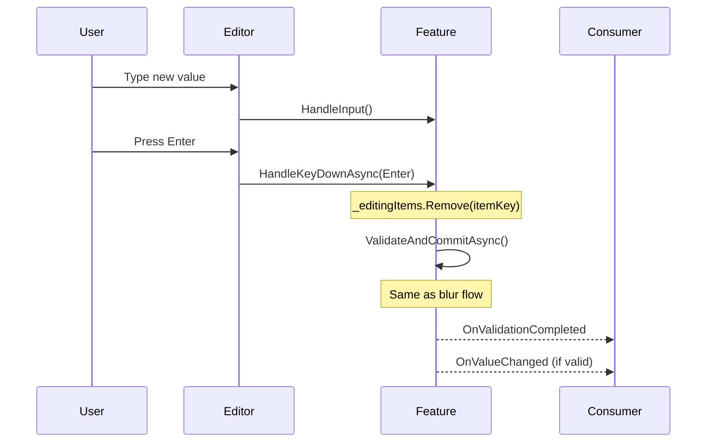
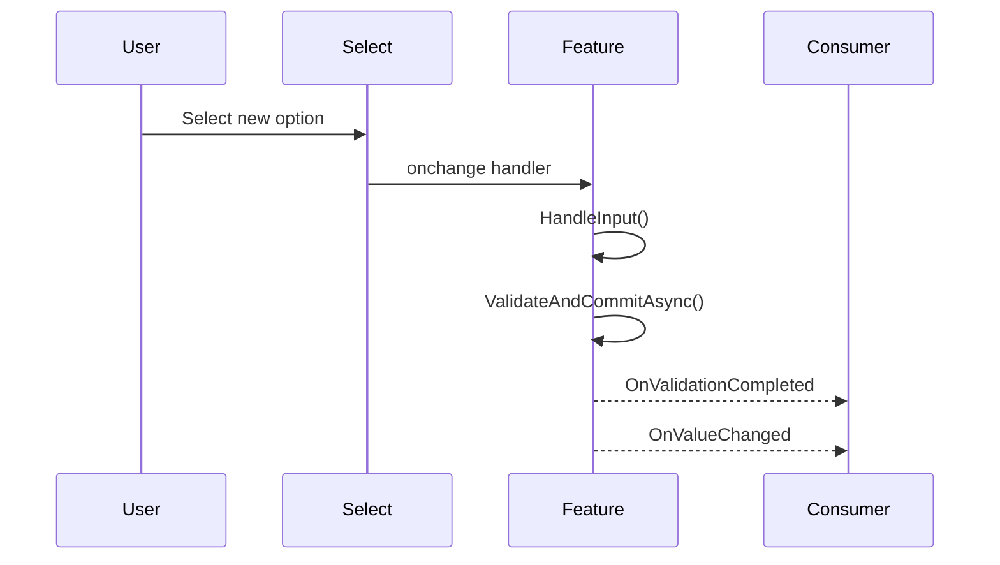
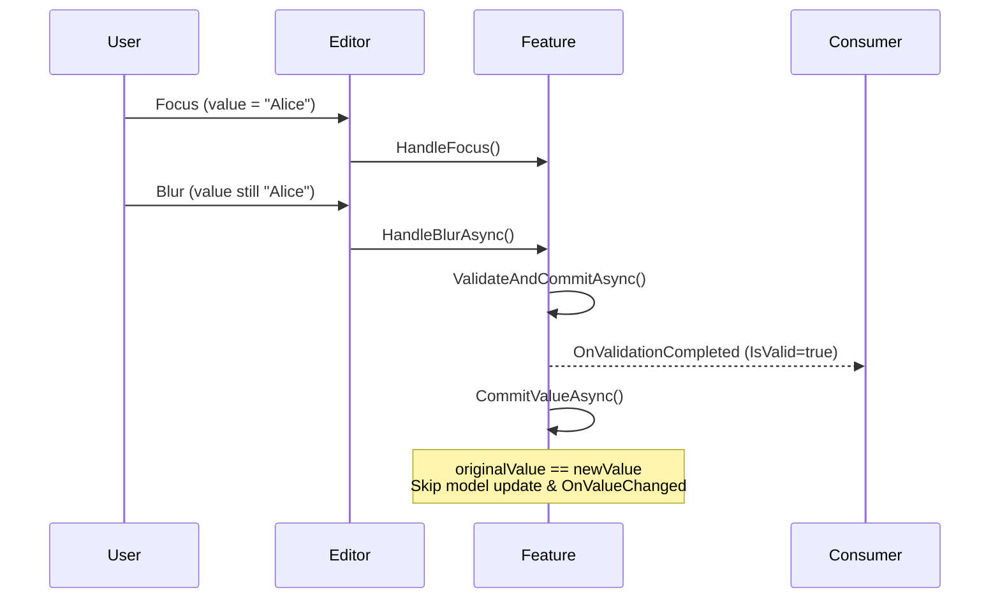

# InlineEditingFeature Event Analysis

## Document Information
| Attribute | Value |
|-----------|-------|
| Created | 2025-12-16 |
| Source File | `QuickGridTest01.ComposableColumns.Features.Editing.EditingFeatures.cs` |
| Target Phase | A (Core Event Infrastructure) |
| Tasks Covered | A1.1, A1.2, A1.3 |

---

## A1.1: Existing Callbacks Enumeration

### Current Callbacks in InlineEditingFeature

| Callback | Type | Location Fired | Payload |
|----------|------|----------------|---------|
| `OnValueChanged` | `EventCallback<ValueChangedEventArgs<TGridItem, TValue>>` | `CommitValueAsync()` (line 771-779) | Item, OldValue, NewValue |
| `OnValidationCompleted` | `EventCallback<ValidationCompletedEventArgs<TGridItem, TValue>>` | `ValidateAndCommitAsync()` (line 686-695) | Item, Value, IsValid, Errors (List<string>) |

### Event Args Classes

#### ValueChangedEventArgs<TGridItem, TValue> (lines 891-896)
```csharp
public class ValueChangedEventArgs<TGridItem, TValue>
{
    public required TGridItem Item { get; init; }
    public TValue? OldValue { get; init; }
    public TValue? NewValue { get; init; }
}
```

#### ValidationCompletedEventArgs<TGridItem, TValue> (lines 903-909)
```csharp
public class ValidationCompletedEventArgs<TGridItem, TValue>
{
    public required TGridItem Item { get; init; }
    public TValue? Value { get; init; }
    public bool IsValid { get; init; }
    public List<string> Errors { get; init; } = [];
}
```

### Internal Event Handlers (Not Exposed as Callbacks)

| Handler | DOM Event | Trigger | Behavior |
|---------|-----------|---------|----------|
| `HandleInput()` | `oninput` | User types in editor | Updates `_currentValues[itemKey]`, clears validation errors |
| `HandleFocus()` | `onfocus` | Editor gains focus | Adds itemKey to `_editingItems`, clears validation errors |
| `HandleBlurAsync()` | `onblur` | Editor loses focus | Removes from `_editingItems`, calls `ValidateAndCommitAsync()` |
| `HandleKeyDownAsync()` | `onkeydown` | Keyboard events | Escape: reverts to original, Enter: validates & commits |

### Internal State Tracking

| Dictionary | Purpose |
|------------|---------|
| `_originalValues` | Stores initial value per item for dirty tracking and revert |
| `_currentValues` | Stores current (possibly uncommitted) value per item |
| `_validationResults` | Stores validation results per item |
| `_editingItems` | HashSet of item keys currently being edited (have focus) |

---

## A1.2: Lifecycle Scenarios Mapping

### Scenario 1: Focus ? Edit ? Blur (Success)



**Events Fired:**
1. `OnValidationCompleted` with `IsValid=true`, empty `Errors`
2. `OnValueChanged` with `OldValue` and `NewValue`

---

### Scenario 2: Focus ? Edit ? Blur (Validation Failure)



**Events Fired:**
1. `OnValidationCompleted` with `IsValid=false`, populated `Errors` list

**Events NOT Fired:**
- `OnValueChanged` (only fires on successful commit)

---

### Scenario 3: Focus ? Edit ? Cancel (Escape)



**Events Fired:**
- NONE (Cancel is silent - no callback fired)

---

### Scenario 4: Focus ? Edit ? Enter (Commit)



**Events Fired (if validation passes):**
1. `OnValidationCompleted` with `IsValid=true`
2. `OnValueChanged`

---

### Scenario 5: Checkbox Toggle


**Note:** Checkbox commits immediately on change (no blur required)

---

### Scenario 6: Select Change



**Note:** Select commits immediately on change (no blur required)

---

### Scenario 7: No Change (Focus ? Blur Same Value)



**Events Fired:**
1. `OnValidationCompleted` with `IsValid=true`

**Events NOT Fired:**
- `OnValueChanged` (value didn't actually change)

---

## A1.3: Gap Analysis

### Summary Table

| Lifecycle Event | Current Callback | Gap | Priority |
|-----------------|------------------|-----|----------|
| Edit Started (Focus) | ? None | No `OnEditStarted` event | Medium |
| Value Input (Keystroke) | ? None | No `OnInput` event (by design - avoid debounce) | Low |
| Edit Cancelled (Escape) | ? None | No `OnEditCancelled` event | **High** |
| Validation Completed | ? `OnValidationCompleted` | Missing: Validator names, timestamps | Medium |
| Value Committed | ? `OnValueChanged` | Missing: Property name, timestamp, item key | Medium |
| Validation Failed | ? `OnValidationCompleted` | Missing: Rule descriptors (name, description, severity) | Medium |

---

### Detailed Gap Report

#### Gap 1: No Edit Started Event
**Current State:** `HandleFocus()` tracks focus internally but doesn't fire a callback.

**Impact:** Consumers cannot:
- Log when editing begins
- Track edit session duration
- Implement "editing indicator" UIs elsewhere

**Recommended Payload:**
```csharp
public class EditStartedEventArgs<TGridItem, TValue>
{
    public required TGridItem Item { get; init; }
    public TValue? CurrentValue { get; init; }
    public string? PropertyName { get; init; }
    public DateTimeOffset Timestamp { get; init; }
}
```

---

#### Gap 2: No Edit Cancelled Event (HIGH PRIORITY)
**Current State:** `HandleKeyDownAsync(Escape)` reverts value silently - no callback fired.

**Impact:** Consumers cannot:
- Log cancelled edits for analytics
- Track edit abandonment rates
- Distinguish between "no change" and "explicitly cancelled"

**Recommended Payload:**
```csharp
public class EditCancelledEventArgs<TGridItem, TValue>
{
    public required TGridItem Item { get; init; }
    public TValue? OriginalValue { get; init; }
    public TValue? AttemptedValue { get; init; }
    public string? PropertyName { get; init; }
    public DateTimeOffset Timestamp { get; init; }
}
```

---

#### Gap 3: Missing Property Name in Payloads
**Current State:** `OnValueChanged` and `OnValidationCompleted` include the Item but not which property was edited.

**Impact:** In grids with multiple editable columns, consumers cannot easily identify which column changed without inspecting old/new values.

**Recommended Fix:** Add `PropertyName` property to:
- `ValueChangedEventArgs<TGridItem, TValue>`
- `ValidationCompletedEventArgs<TGridItem, TValue>`

---

#### Gap 4: Missing Timestamps
**Current State:** No timestamps in event payloads.

**Impact:** Consumers cannot:
- Calculate edit duration
- Order events chronologically
- Implement time-based analytics

**Recommended Fix:** Add `DateTimeOffset Timestamp` to all event args classes.

---

#### Gap 5: Missing Item Key in Payloads
**Current State:** Item is included, but not the computed key used for internal tracking.

**Impact:** Consumers must recompute the key if they need to correlate events.

**Recommended Fix:** Add `object ItemKey` property to event args (optional - Item may be sufficient).

---

#### Gap 6: Validation Events Lack Rule Metadata
**Current State:** `OnValidationCompleted.Errors` is `List<string>` - just error messages.

**Impact:** Consumers cannot:
- Display which validator failed (by name)
- Show rule descriptions to users
- Categorize failures by severity

**Recommended Fix:** Include validator metadata:
```csharp
public record ValidationRuleDescriptor(
    string Name,
    string? Description,
    ValidationSeverity Severity
);

public class ValidationCompletedEventArgs<TGridItem, TValue>
{
    // ... existing properties ...
    public List<ValidationRuleResult> Results { get; init; } = [];
}

public class ValidationRuleResult
{
    public string RuleName { get; init; }
    public bool IsValid { get; init; }
    public string? ErrorMessage { get; init; }
    public ValidationSeverity Severity { get; init; }
}
```

---

#### Gap 7: No Grid-Level Event Aggregation
**Current State:** Each `InlineEditingFeature` instance fires its own callbacks. There's no grid-level event stream.

**Impact:** Consumers must:
- Wire up callbacks for every editable column
- Manually aggregate events for change log UIs
- Handle event ordering across columns

**Recommended Fix (per spec):** Implement `IEditEventStream` as a cascading value:
```csharp
public interface IEditEventStream
{
    IReadOnlyList<EditEventBase> RecentEvents { get; }
    event Action<EditEventBase>? EventPublished;
    Task PublishAsync(EditEventBase @event);
}
```

---

### Gap Priority Matrix

| Gap | User Impact | Implementation Effort | Priority |
|-----|-------------|----------------------|----------|
| Edit Cancelled Event | High (analytics blind spot) | Low | **P0** |
| Grid-Level Event Stream | High (spec requirement) | Medium | **P0** |
| Validation Rule Metadata | Medium (UX enhancement) | Low | **P1** |
| Property Name in Payloads | Medium (debugging) | Low | **P1** |
| Timestamps | Medium (analytics) | Low | **P1** |
| Edit Started Event | Low (nice-to-have) | Low | **P2** |
| Item Key in Payloads | Low (convenience) | Low | **P2** |

---

## Next Steps

Based on this analysis, the following tasks in Phase A should address these gaps:

1. **A2.1**: Define payload contracts including:
   - `EditEventBase` with common properties (ItemKey, PropertyName, Timestamp)
   - `EditStartedEvent`, `EditCommittedEvent`, `EditCancelledEvent`, `ValidationFailedEvent`
   - `ValidationRuleDescriptor` record

2. **A2.2**: Define `IEditEventStream` interface and `EditEventStream` implementation

3. **A3.1**: Add `ShowEvents` parameter to `InlineEditingFeature` to publish to cascaded stream

4. **A3.2-A3.7**: Tests for all new event publishing behavior
